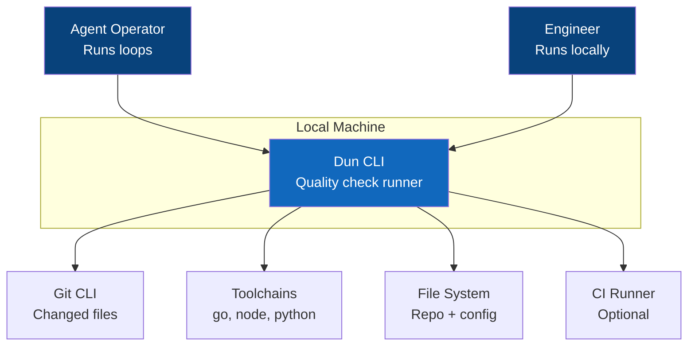
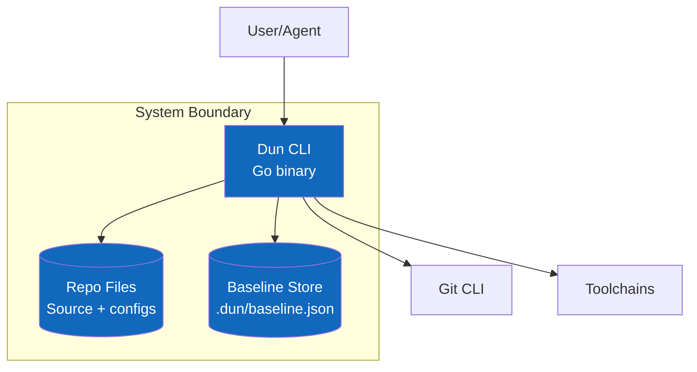
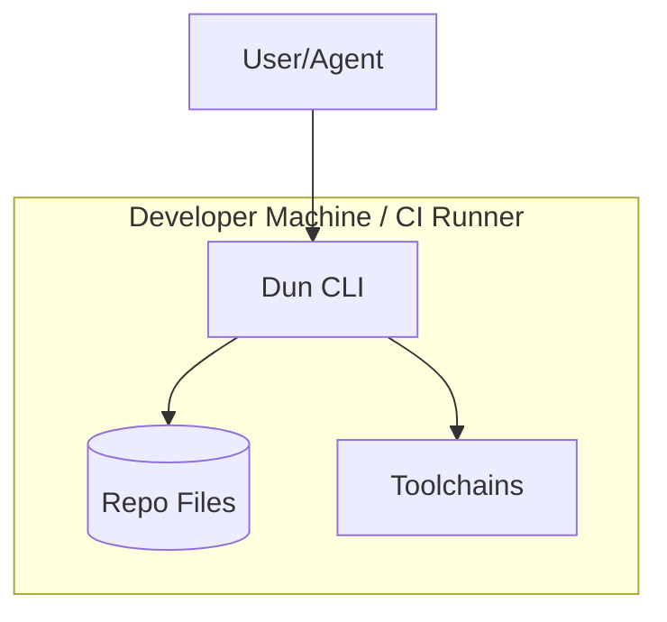
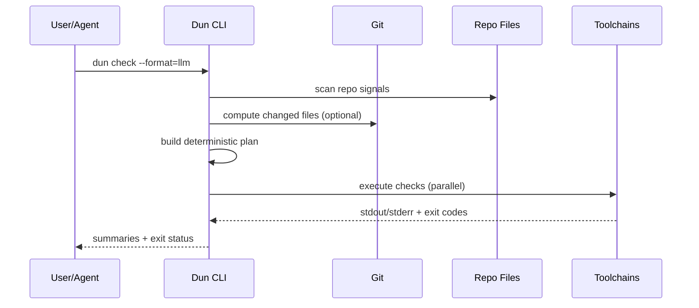
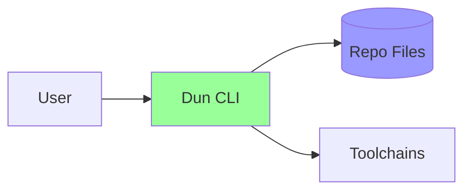

# Architecture Diagrams

*Visual documentation using the C4 model for clear system understanding*

## C4 Model Overview

The C4 model uses four levels of abstraction to document software architecture:
1. **Context** - How the system fits in the world
2. **Container** - High-level technology choices
3. **Component** - How containers are decomposed
4. **Code** - How components are implemented (rarely needed)

## Level 1: System Context

### Purpose
Shows how the system fits into the larger ecosystem.

### System Context Diagram


### Key Elements
- **Users**: Agent operators and engineers running `dun check`.
- **Our System**: Dun CLI that discovers, runs, and summarizes checks.
- **External Systems**: Git, language toolchains, file system, CI runners.

### Interactions
| From | To | Purpose | Protocol |
|------|----|---------|----------|
| User | Dun | Run checks | CLI |
| Dun | Git | Detect changes | CLI |
| Dun | Toolchains | Execute checks | CLI |
| Dun | File System | Discover and read config | FS |
| Dun | CI Runner | Run in pipelines | CLI |

## Level 2: Container Diagram

### Purpose
Shows the major technology choices and how they communicate.

### Container Diagram


### Container Descriptions

#### Container: Dun CLI
- **Technology**: Go binary
- **Purpose**: Discover checks, execute them, and report results
- **Responsibilities**:
  - Build deterministic plan
  - Execute checks with limits
  - Emit LLM and JSON outputs
- **Communication**: CLI, file system, subprocess exec

#### Container: Repo Files
- **Technology**: Local file system
- **Purpose**: Inputs for discovery and execution
- **Responsibilities**:
  - Config files
  - Source code
  - Tool configs
- **Communication**: File read and stat

#### Container: Baseline Store
- **Technology**: Local JSON file
- **Purpose**: Ratchet baseline for regressions
- **Responsibilities**:
  - Store prior metrics
  - Provide comparison data
- **Communication**: File read/write

### Container Interactions
| From | To | Purpose | Protocol | Format |
|------|----|---------|---------:|--------|
| User | Dun CLI | Trigger checks | CLI | Args |
| Dun CLI | Git | Compute change set | CLI | Text |
| Dun CLI | Toolchains | Run checks | CLI | Text |
| Dun CLI | Repo Files | Discover checks | FS | Files |
| Dun CLI | Baseline | Read/write baseline | FS | JSON |

## Level 3: Component Diagram

### Purpose
Shows the internal structure of each container.

### Component Diagram - Dun CLI
```mermaid
graph TB
    subgraph "Dun CLI"
        Entry[CLI Entry<br/>Args + config]
        Plug[Plugin Registry<br/>Manifests + triggers]
        Disc[Discovery Engine<br/>Signals + checks]
        Plan[Planner<br/>Deterministic plan]
        Run[Runner<br/>Workers + timeouts]
        Prompt[Prompt Renderer<br/>Prompt templates]
        Emit[Prompt Emitter<br/>Prompt envelopes]
        Agent[Agent Runner (Optional)<br/>Response parser]
        Proc[Processor<br/>Summaries]
        Rep[Reporter<br/>LLM/JSON output]
        Policy[Policy Engine<br/>Ratchet + exit code]
    end

    Entry --> Plug
    Plug --> Disc
    Disc --> Plan
    Plan --> Run
    Plan --> Prompt
    Prompt --> Emit
    Emit --> Agent
    Run --> Proc
    Emit --> Proc
    Agent --> Proc
    Proc --> Rep
    Policy --> Plan
    Policy --> Rep

    style Entry fill:#85bbf0,color:#000
    style Plug fill:#85bbf0,color:#000
    style Disc fill:#85bbf0,color:#000
    style Plan fill:#85bbf0,color:#000
    style Run fill:#85bbf0,color:#000
    style Prompt fill:#85bbf0,color:#000
    style Agent fill:#85bbf0,color:#000
    style Proc fill:#85bbf0,color:#000
    style Rep fill:#85bbf0,color:#000
    style Policy fill:#85bbf0,color:#000
```

### Component Descriptions

#### Component: CLI Entry
- **Purpose**: Parse flags, config, and route commands.
- **Responsibilities**:
  - Validate arguments
  - Load config overrides
- **Implementation Notes**: Minimal dependencies, predictable defaults.

#### Component: Plugin Registry
- **Purpose**: Load built-in and external plugin manifests.
- **Responsibilities**:
  - Validate plugin schema
  - Expose triggers and checks to discovery
- **Implementation Notes**: Keep manifests deterministic and cached.

#### Component: Discovery Engine
- **Purpose**: Detect repo signals and candidate checks.
- **Responsibilities**:
  - File pattern detection
  - Config parsing
- **Implementation Notes**: Use fast file walks with allowlists.

#### Component: Planner
- **Purpose**: Build a deterministic plan.
- **Responsibilities**:
  - De-duplicate checks
  - Apply `--changed`
- **Implementation Notes**: Stable sort by check ID.

#### Component: Runner
- **Purpose**: Execute checks with bounds.
- **Responsibilities**:
  - Worker pool
  - Timeouts and cancellation
- **Implementation Notes**: Capture stdout/stderr per check.

#### Component: Prompt Renderer
- **Purpose**: Build prompts for agent-based checks.
- **Responsibilities**:
  - Render templates with file paths and context
  - Emit response schema for parsing
- **Implementation Notes**: Use stable templates and sorted inputs.

#### Component: Prompt Emitter
- **Purpose**: Emit prompt envelopes for agent-based checks.
- **Responsibilities**:
  - Package prompt text, inputs, and callback command
  - Mark checks as `prompt` when agent input is required
- **Implementation Notes**: Output is deterministic and machine-readable.

#### Component: Drift Analyzer
- **Purpose**: Detect documentation/implementation drift.
- **Responsibilities**:
  - Compare Helix artifacts across phases
  - Emit ordered reconciliation issues
- **Implementation Notes**: Deterministic ordering and stable IDs.

#### Component: Automation Policy
- **Purpose**: Control agent autonomy per run.
- **Responsibilities**:
  - Enforce manual/plan/auto/yolo modes
  - Inject mode into prompt envelopes
- **Implementation Notes**: Default to manual.

#### Component: Agent Runner (Optional)
- **Purpose**: Execute prompt checks via a configured agent when requested.
- **Responsibilities**:
  - Invoke agent command (opt-in)
  - Parse structured response
- **Implementation Notes**: Fail on invalid responses to keep determinism.

#### Component: Processor
- **Purpose**: Summarize check output.
- **Responsibilities**:
  - Classify status
  - Produce signal/detail/next
- **Implementation Notes**: Keep summaries short and deterministic.

#### Component: Reporter
- **Purpose**: Render output and summary.
- **Responsibilities**:
  - LLM text blocks
  - JSON schema output
- **Implementation Notes**: Stable ordering and schema versioning.

#### Component: Policy Engine
- **Purpose**: Apply severity and ratchet rules.
- **Responsibilities**:
  - Compare baseline
  - Determine exit code
- **Implementation Notes**: Separate policy from execution.

## Deployment Diagram

### Purpose
Shows how the system is deployed to infrastructure.

### Deployment Diagram


### Deployment Specifications

| Component | Infrastructure | Instances | Scaling | Notes |
|-----------|---------------|-----------|---------|-------|
| Dun CLI | Local binary | 1 | N/A | Runs per invocation |
| Toolchains | Local install | N/A | N/A | External dependency |
| Repo | Local checkout | 1 | N/A | Uses current workspace |

## Data Flow Diagrams

### Purpose
Shows how data moves through the system.

### `dun check` Data Flow


## Architecture Decisions Summary

### Key Architectural Patterns
- **Pattern**: Discover-Plan-Run-Report pipeline for deterministic output.
- **Pattern**: Policy layer separated from execution for ratchets.

### Technology Stack Rationale
| Layer | Technology | Why Chosen |
|-------|------------|------------|
| CLI | Go | Fast, portable, static binary |
| Storage | Local JSON | Simple baseline persistence |
| Execution | OS subprocess | Leverage existing toolchains |

## Scalability Considerations

### Horizontal Scaling Points
- Runner workers scale with CPU cores.
- `--changed` reduces work proportional to diff size.

### Bottlenecks and Mitigation
- Slow toolchains: mitigate with timeouts and `--changed`.
- Heavy discovery: mitigate with allowlists and caching.

## Security Architecture

### Security Layers


### Security Controls
- **Network**: No outbound network required by default.
- **Application**: Local execution only, no privileged operations.
- **Data**: Baselines stored locally in repo directory.

## Monitoring and Observability

### Monitoring Points
- **Application**: Exit status, duration, and per-check timings.
- **Business**: Pass/fail rates and time-to-green in loops.

### Observability Stack
- **Metrics**: CLI timing logs (stdout or JSON).
- **Logging**: Check output captured per check.
- **Tracing**: Not applicable for MVP.

## Disaster Recovery

### Recovery Strategy
- **RTO**: Immediate (rerun the command).
- **RPO**: None (no critical data persisted).
- **Backup Strategy**: Optional baseline file under `.dun/`.
- **Failover Process**: N/A for local CLI.

---
*These diagrams provide a comprehensive view of the system architecture at multiple levels of abstraction.*
