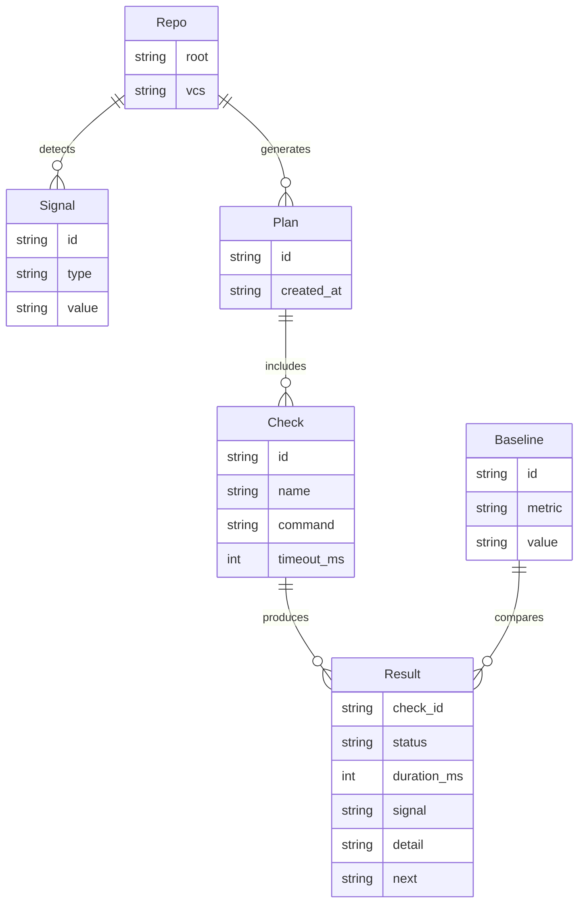
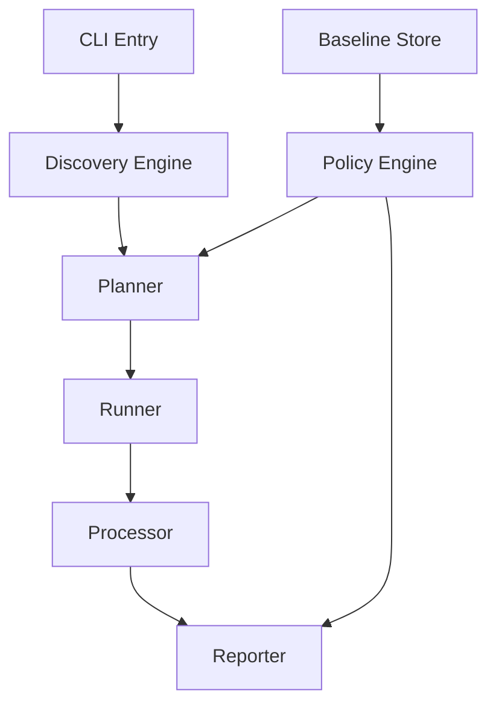

# Solution Design: Dun

*Bridge between business requirements and technical implementation*

## Requirements Analysis

### Functional Requirements Mapping
Map each functional requirement to technical capabilities:

| Requirement | Technical Capability | Component | Priority |
|------------|---------------------|-----------|----------|
| FR-001 Auto-discover repo tooling | Scan files and configs to detect checks | Discovery Engine | P0 |
| FR-002 Stable check plan | Deterministic ordering and IDs | Planner | P0 |
| FR-003 Parallel execution | Worker pool with timeouts | Runner | P0 |
| FR-004 LLM output | Structured summaries per check | Reporter | P0 |
| FR-005 JSON output | Machine-readable results | Reporter | P0 |
| FR-006 `--changed` scope | Limit checks to affected areas | Planner | P1 |
| FR-007 Quality ratchet | Baseline compare and regressions | Policy Engine | P1 |
| FR-008 Config overrides | Minimal config file support | Config Loader | P1 |
| FR-009 Plugins | External checks and processors | Extension Registry | P2 |

### Non-Functional Requirements Impact
How NFRs shape the architecture:

| NFR Category | Requirement | Architectural Impact | Design Decision |
|--------------|------------|---------------------|-----------------|
| Performance | < 2s to first output | Fast scan, lazy IO | Cache discovery results where safe |
| Determinism | Stable plan and output | Ordered IDs and outputs | Sort checks by ID and scope |
| Portability | Single binary | No runtime deps | Go + stdlib, static builds |
| Reliability | Bounded runtime | Timeouts and global budget | Per-check timeout + global budget |
| Usability | One command | Minimal configuration | `dun check` as default |
| Security | Local-only execution | No network required | Opt-in for remote plugins only |

## Solution Approaches

### Approach 1: Shell Orchestrator
**Description**: A bash script that detects files and runs existing tools.

**Pros**:
- Very fast to prototype
- Easy to hack locally

**Cons**:
- Hard to test and extend
- Non-deterministic output and fragile parsing

**Evaluation**: Rejected due to maintainability and portability limits.

### Approach 2: Go CLI with Modular Core
**Description**: A Go binary with discoverers, planners, runners, and reporters.

**Pros**:
- Portable and fast startup
- Strong interfaces and testability

**Cons**:
- Higher upfront design cost
- Requires careful output contracts

**Evaluation**: Selected for durability, speed, and determinism.

### Approach 3: Extend Hook Runners
**Description**: Build on tools like lefthook and add discovery.

**Pros**:
- Reuse existing workflows
- Familiar for teams

**Cons**:
- Hooks are static by design
- Output formats optimized for humans, not agents

**Evaluation**: Not sufficient for dynamic discovery or LLM output needs.

### Selected Approach
**Decision**: Approach 2 (Go CLI with modular core)
**Rationale**: Meets portability and determinism goals while enabling extensible
discovery and stable, structured output.

## Domain Model

### Core Entities
Identify the key business concepts:

### Business Rules
Critical domain logic to implement:
1. Check IDs are stable for the same repo state.
2. Output blocks are sorted by check ID and scope.
3. Any timeout marks the check as `timeout` and is surfaced in summary.
4. `--changed` only narrows scope; it never invents new checks.

### Bounded Contexts (if applicable)
- **Discovery**: signals, check registration, and plan building
- **Execution**: running checks and capturing outputs
- **Reporting**: summarization, formatting, and exit codes

## System Decomposition

### Component Identification
Breaking down the system into manageable parts:

#### Component 1: CLI Entry
- **Purpose**: Parse commands, flags, and config.
- **Responsibilities**:
  - Read args and config
  - Route to command handlers
- **Requirements Addressed**: FR-001 to FR-006
- **Interfaces**: CLI flags, config file

#### Component 2: Discovery Engine
- **Purpose**: Detect repo signals and candidate checks.
- **Responsibilities**:
  - Scan files and configs
  - Emit signals to planner
- **Requirements Addressed**: FR-001
- **Interfaces**: File system, registry of discoverers

#### Component 3: Planner
- **Purpose**: Build a deterministic check plan.
- **Responsibilities**:
  - De-duplicate checks
  - Order by stable rules
  - Apply `--changed` filters
- **Requirements Addressed**: FR-002, FR-006
- **Interfaces**: Signals, policy, config

#### Component 4: Runner
- **Purpose**: Execute checks with resource limits.
- **Responsibilities**:
  - Worker pool execution
  - Per-check timeout enforcement
  - Capture stdout/stderr
- **Requirements Addressed**: FR-003
- **Interfaces**: OS exec, timers

#### Component 5: Processor
- **Purpose**: Classify results and summarize output.
- **Responsibilities**:
  - Status classification
  - Summarize to signal/detail/next
- **Requirements Addressed**: FR-004
- **Interfaces**: Result stream

#### Component 6: Reporter
- **Purpose**: Render outputs and exit codes.
- **Responsibilities**:
  - LLM format output
  - JSON output
- **Requirements Addressed**: FR-004, FR-005
- **Interfaces**: stdout, schema versioning

#### Component 7: Policy Engine
- **Purpose**: Apply severity and ratchet rules.
- **Responsibilities**:
  - Baseline comparison
  - Exit status determination
- **Requirements Addressed**: FR-007
- **Interfaces**: Baseline store

#### Component 8: Extension Registry
- **Purpose**: Register custom checks and processors.
- **Responsibilities**:
  - Plugin registration
  - Validation of extensions
- **Requirements Addressed**: FR-009
- **Interfaces**: Plugin API (future)

### Component Interactions

## Technology Selection Rationale

### Programming Language: Go
**Why**: Fast startup, static binaries, strong tooling, and good concurrency.
**Alternatives Considered**: Rust (higher complexity), Node (runtime deps).

### Framework: Go Standard Library
**Why**: Keep dependencies minimal and output deterministic.
**Alternatives Considered**: Cobra, urfave/cli (adds weight and indirection).

### Database: None (File-based Baseline)
**Why**: Baseline can be a local JSON file in `.dun/` for MVP.
**Alternatives Considered**: SQLite (adds runtime complexity).

### Infrastructure: Local CLI + CI Integration
**Why**: Primary use is local loop; CI runs the same binary.
**Alternatives Considered**: Hosted service (out of scope).

## Requirements Traceability

### Coverage Check
Ensure all requirements are addressed:

| Requirement ID | Requirement | Component | Design Element | Test Strategy |
|---------------|-------------|-----------|----------------|---------------|
| FR-001 | Auto-discovery | Discovery Engine | Discoverer registry | Unit tests |
| FR-002 | Stable plan | Planner | Sorted plan rules | Unit tests |
| FR-003 | Parallel checks | Runner | Worker pool + timeouts | Integration tests |
| FR-004 | LLM output | Reporter | LLM formatter | Golden tests |
| FR-005 | JSON output | Reporter | JSON schema | Golden tests |
| FR-006 | `--changed` | Planner | Git diff filter | Integration tests |
| FR-007 | Ratchet | Policy Engine | Baseline compare | Unit tests |
| FR-008 | Config | Config Loader | Override merge | Unit tests |
| FR-009 | Plugins | Extension Registry | Plugin API | Contract tests |

### Gap Analysis
Requirements not fully addressed:
- [ ] FR-009 Plugins: requires a safe, portable extension model.

## Constraints and Assumptions

### Technical Constraints
- Single static Go binary with no runtime service dependencies.
- Bounded runtime and concurrency for safe local use.

### Assumptions
- Repos already have underlying toolchains installed.
- Git is available for change detection.

### Dependencies
- Git CLI for `--changed` (fallback to full scan if missing).
- Language toolchains (Go, Node, Python, etc).

## Migration from Current State

### Current System Analysis (if applicable)
- **Existing functionality**: None (greenfield).
- **Data migration needs**: None.
- **Integration points**: Optional hook/CI integration.

### Migration Strategy
1. **Phase 1**: Introduce `dun check` in local loops.
2. **Phase 2**: Add to CI as a non-blocking job.
3. **Phase 3**: Promote to blocking with ratchet rules.

## Risk Assessment

### Technical Risks
| Risk | Probability | Impact | Mitigation |
|------|------------|--------|------------|
| Slow checks degrade UX | Med | High | `--changed`, timeouts, worker limits |
| Discovery misses checks | Med | Med | Expand discoverers, allow config overrides |
| Output noise reduces trust | Med | High | Strict output contract and trimming |

### Design Risks
| Risk | Probability | Impact | Mitigation |
|------|------------|--------|------------|
| Over-engineered plugin model | Low | Med | Defer until core is stable |
| Too much config | Low | Med | Prefer discovery, minimal overrides |

## Success Criteria

### Design Validation
- [ ] All P0 requirements mapped to components
- [ ] All NFRs addressed in architecture
- [ ] Domain model captures core entities
- [ ] Technology choices justified against requirements
- [ ] Stable output contract defined

### Handoff to Implementation
This design is ready when:
- [ ] CLI contract is approved
- [ ] Test strategy aligns with design
- [ ] Stakeholders approve the approach

---
*This solution design bridges the gap between what the business needs and how we'll build it technically.*
