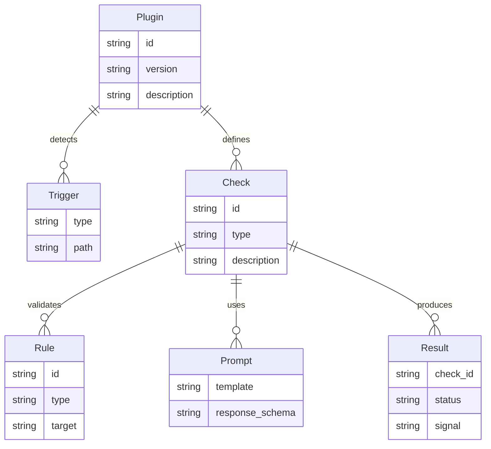

# Solution Design: Plugin System

*Bridge between business requirements and technical implementation*

## Requirements Analysis

### Functional Requirements Mapping
Map each functional requirement to technical capabilities:

| Requirement | Technical Capability | Component | Priority |
|------------|---------------------|-----------|----------|
| FR-P-001 Auto-detect workflow | Trigger plugins based on repo signals | Plugin Loader | P0 |
| FR-P-002 Helix docs validation | Parse gates and required artifacts | Rule Engine | P0 |
| FR-P-003 Cross-validation | Compare specs, design, tests, implementation | Prompt Emitter | P0 |
| FR-P-004 Extensible checks | Plugin manifest defines checks and rules | Plugin Registry | P0 |
| FR-P-005 Prompt-based checks | Prompt-as-data emission | Prompt Renderer | P0 |
| FR-P-006 Deterministic plan | Stable check IDs and ordering | Planner | P0 |
| FR-P-007 Safe defaults | No external network by default | Runner | P1 |
| FR-P-008 Custom plugins | Load external plugin dirs | Plugin Loader | P1 |

### Non-Functional Requirements Impact
How NFRs shape the architecture:

| NFR Category | Requirement | Architectural Impact | Design Decision |
|--------------|------------|---------------------|-----------------|
| Determinism | Stable ordering | Stable IDs and sort rules | Check IDs are manifest-defined |
| Performance | Fast discovery | Cached manifests, shallow scans | Detect by sentinel files |
| Portability | Single binary | Embedded built-in plugins | Packaged plugin assets |
| Usability | Zero-config | Auto-detect and auto-run | Optional overrides only |
| Safety | No network by default | Prompt emission by default | Agent runner optional |

## Solution Approaches

### Approach 1: Hardcode Helix Checks
**Description**: Build a fixed Helix validator into core.

**Pros**:
- Quick to implement
- No plugin loader required

**Cons**:
- Tight coupling to one workflow
- Hard to evolve without code changes

**Evaluation**: Rejected due to lack of extensibility.

### Approach 2: Plugin Manifests + Built-in Validators
**Description**: Plugins define checks and rules in YAML, with a shared validator
library and optional agent prompts.

**Pros**:
- Works for Helix and other workflows
- Easy to add new checks without code changes

**Cons**:
- Requires a manifest schema and loader
- Validation library must be robust

**Evaluation**: Selected as the best balance of extensibility and control.

### Approach 3: Script-Based Plugins
**Description**: Plugins are arbitrary scripts run by Dun.

**Pros**:
- Very flexible
- Easy to author

**Cons**:
- Non-deterministic output
- Hard to secure and test

**Evaluation**: Rejected for safety and determinism.

### Selected Approach
**Decision**: Approach 2 (Manifest-driven plugins with validator library)
**Rationale**: Enables Helix detection while keeping Dun generic and predictable.

## Domain Model

### Core Entities
Identify the key business concepts:



### Business Rules
Critical domain logic to implement:
1. Plugin checks are only enabled when triggers match.
2. Check IDs must be unique and stable across runs.
3. Agent responses must be structured when provided.
4. Gate checks execute in phase order (frame -> design -> test -> build).
5. Checks may declare conditions that gate execution.

### Bounded Contexts (if applicable)
- **Plugin Discovery**: load manifests and match triggers
- **Validation**: execute rule checks on files and metadata
- **Prompt Emission**: prompt envelopes and optional response parsing

## System Decomposition

### Component Identification
Breaking down the system into manageable parts:

#### Component 1: Plugin Registry
- **Purpose**: Register built-in and external plugins.
- **Responsibilities**:
  - Load plugin manifests
  - Validate schema
- **Requirements Addressed**: FR-P-001, FR-P-004
- **Interfaces**: File system, embedded assets

#### Component 2: Plugin Loader
- **Purpose**: Detect applicable plugins.
- **Responsibilities**:
  - Evaluate triggers
  - Emit plugin checks
- **Requirements Addressed**: FR-P-001
- **Interfaces**: File system, planner

#### Component 3: Rule Engine
- **Purpose**: Execute built-in validators.
- **Responsibilities**:
  - File existence and patterns
  - Cross-reference checks
  - Gate validation rules
- **Requirements Addressed**: FR-P-002
- **Interfaces**: File system, results

#### Component 4: Prompt Renderer
- **Purpose**: Build prompts for agent checks.
- **Responsibilities**:
  - Render templates with file paths
  - Include response schema
- **Requirements Addressed**: FR-P-005
- **Interfaces**: Template engine

#### Component 5: Prompt Emitter
- **Purpose**: Emit prompt envelopes for agent checks.
- **Responsibilities**:
  - Package prompt text, inputs, and callback command
  - Mark checks as `prompt` in results
- **Requirements Addressed**: FR-P-003, FR-P-005
- **Interfaces**: Reporter

#### Component 6: Agent Runner (Optional)
- **Purpose**: Execute prompt-based checks when requested.
- **Responsibilities**:
  - Invoke configured agent command
  - Parse structured response
- **Requirements Addressed**: FR-P-003
- **Interfaces**: External agent, JSON parser

### Component Interactions
```mermaid
graph TD
    REG[Plugin Registry] --> LOAD[Plugin Loader]
    LOAD --> PLAN[Planner]
    PLAN --> RULES[Rule Engine]
    PLAN --> PROMPT[Prompt Renderer]
    PROMPT --> EMIT[Prompt Emitter]
    EMIT --> AGENT[Agent Runner (Optional)]
```

## Prompt-as-Data Execution

Agent checks use a prompt-as-data pattern:
1. The plugin defines a prompt template and response schema.
2. Dun renders the prompt with paths and context.
3. Dun emits a prompt envelope with a callback command.
4. A CLI agent runs the prompt and calls back into Dun with the response.
5. Optional auto mode executes the agent directly.

This keeps checks deterministic while allowing deep cross-validation that is
not feasible with simple rules.

## Helix Plugin Sketch

### Detection Triggers
- `docs/helix/` directory exists
- `docs/helix/01-frame/` and `docs/helix/02-design/` present

### Core Checks
- `helix-structure`: required phase artifacts exist (rule-set)
- `helix-gates`: phase gates satisfied based on `input-gates.yml` and
  `exit-gates.yml` (rule-set)
- `helix-crossrefs`: artifact cross-references are present (rule-set)
- `helix-state-rules`: enforce story progression (state-rules)
- `helix-spec-to-design`: PRD and feature specs align with solution design
  (agent)
- `helix-design-to-test`: design artifacts align with test plans (agent)
- `helix-test-to-build`: test plans align with implementation plans (agent)
- `helix-reconcile-stack`: plan doc/code reconciliation across artifacts (agent)

### Phase Ordering
Checks run in phase order (frame -> design -> test -> build) and stop at the
first blocking gate, so the loop stays top-down and focused.

## Technology Selection Rationale

### Manifest Format: YAML
**Why**: Human-friendly and already used in Helix definitions.
**Alternatives Considered**: JSON (less readable), TOML (less common).

### Template Engine: Go text/template
**Why**: Standard library, deterministic, minimal dependencies.
**Alternatives Considered**: Hand-rolled templating (harder to maintain).

## Requirements Traceability

### Coverage Check
Ensure all requirements are addressed:

| Requirement ID | Requirement | Component | Design Element | Test Strategy |
|---------------|-------------|-----------|----------------|---------------|
| FR-P-001 | Auto-detect workflow | Plugin Loader | Trigger matching | Unit tests |
| FR-P-002 | Helix validation | Rule Engine | Gate rules | Unit tests |
| FR-P-003 | Cross-validation | Prompt Emitter | Prompt envelopes | Contract tests |
| FR-P-004 | Extensible checks | Plugin Registry | Manifest schema | Unit tests |
| FR-P-005 | Prompt-based checks | Prompt Renderer | Templates | Golden tests |

### Gap Analysis
Requirements not fully addressed:
- [ ] External plugin signing and sandboxing (future).

## Constraints and Assumptions

### Technical Constraints
- No network required by default.
- Plugins must be deterministic and file-based.

### Assumptions
- Repos that use Helix include recognizable docs structure.
- Prompt emission is default; agent execution is optional.

### Dependencies
- YAML parser for manifests.
- JSON parser for agent responses (auto mode).

## Migration from Current State

### Current System Analysis (if applicable)
- **Existing functionality**: No plugin support yet.
- **Data migration needs**: None.

### Migration Strategy
1. **Phase 1**: Built-in Helix plugin (embedded manifest).
2. **Phase 2**: External plugin directories via config.
3. **Phase 3**: Optional plugin marketplace or registry.

## Risk Assessment

### Technical Risks
| Risk | Probability | Impact | Mitigation |
|------|------------|--------|------------|
| Agent responses are inconsistent | Med | High | Strict response schema, parse failure -> fail |
| Gate rules drift from docs | Med | Med | Derive gates from manifest files |
| Plugin complexity explodes | Low | Med | Keep validator set small and composable |

### Design Risks
| Risk | Probability | Impact | Mitigation |
|------|------------|--------|------------|
| Over-reliance on prompts | Med | Med | Use rule checks where possible |
| Too many trigger heuristics | Low | Low | Prefer explicit sentinel files |

## Success Criteria

### Design Validation
- [ ] Helix plugin can be defined without core changes
- [ ] Prompt envelopes have a clear contract and schema
- [ ] Deterministic check ordering is preserved

### Handoff to Implementation
This design is ready when:
- [ ] Plugin manifest contract is approved
- [ ] Helix plugin check list is finalized
- [ ] Prompt callback and optional agent runner configuration is defined

---
*This solution design describes an extensible plugin system that enables Helix and other workflows without hardcoding.*
