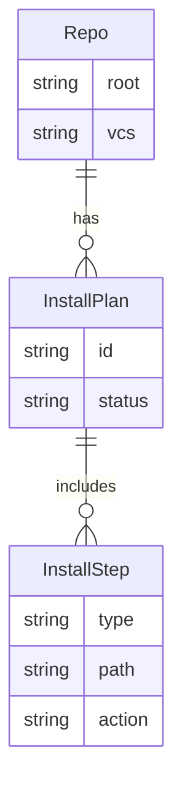
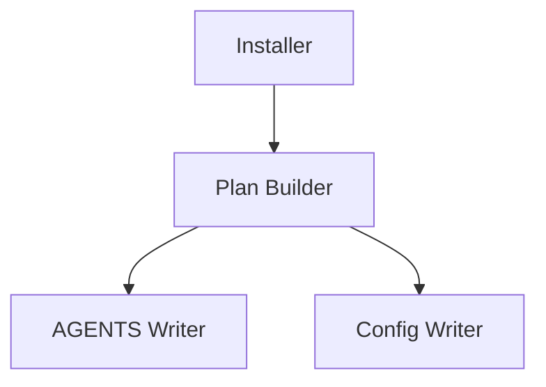

# Solution Design: Dun Install Command

*Bridge between business requirements and technical implementation*

## Requirements Analysis

### Functional Requirements Mapping
Map each functional requirement to technical capabilities:

| Requirement | Technical Capability | Component | Priority |
|------------|---------------------|-----------|----------|
| FR-I-001 Initialize repo | Detect repo root and write AGENTS.md | Installer | P0 |
| FR-I-002 AGENTS.md helper | Insert Dun tool guidance | Template Writer | P0 |
| FR-I-003 Safe updates | Idempotent edits with markers | File Editor | P0 |
| FR-I-005 Config scaffold | Create `.dun/config.yaml` if missing | Config Writer | P0 |
| FR-I-004 Dry run | Show actions without changes | Planner | P1 |

### Non-Functional Requirements Impact
How NFRs shape the architecture:

| NFR Category | Requirement | Architectural Impact | Design Decision |
|--------------|------------|---------------------|-----------------|
| Safety | Avoid destructive edits | Idempotent edits | Marker-based insertion |
| Usability | Minimal steps | Single command | `dun install` default |
| Portability | Works across repos | Avoid hardcoded paths | Use repo root detection |
| Determinism | Repeatable output | Same edits each run | Insert markers |

## Solution Approaches

### Approach 1: One-shot Script
**Description**: A shell script that edits AGENTS.md.

**Pros**:
- Fast to implement
- Easy to run manually

**Cons**:
- Hard to test and maintain
- Limited idempotency and validation

**Evaluation**: Rejected due to safety concerns.

### Approach 2: Built-in CLI Command
**Description**: `dun install` performs structured edits with markers.

**Pros**:
- Testable, deterministic
- Can support dry-run and idempotent updates

**Cons**:
- More code to maintain

**Evaluation**: Selected for safety and future automation.

### Selected Approach
**Decision**: Implement `dun install` as a first-class command.
**Rationale**: Enables reliable setup and repeatable changes.

## Domain Model

### Core Entities
Identify the key business concepts:

### Business Rules
Critical domain logic to implement:
1. Install is idempotent (re-run should not duplicate content).
2. Edits must use markers for safe updates.
3. Conflicts require user confirmation or abort.

## System Decomposition

### Component Identification

#### Component 1: Installer
- **Purpose**: Orchestrate install steps.
- **Responsibilities**:
  - Build plan
  - Execute steps

#### Component 2: Template Writer
- **Purpose**: Insert Dun guidance into AGENTS.md.
- **Responsibilities**:
  - Create file if missing
  - Insert snippet under markers

#### Component 3: Config Writer
- **Purpose**: Create `.dun/config.yaml` with defaults.
- **Responsibilities**:
  - Create `.dun/` directory if missing
  - Write default config only when absent

### Component Interactions

## Technology Selection Rationale

### File Editing: Marker-based
**Why**: Supports safe, idempotent updates.
**Alternatives Considered**: Full file rewrite (too risky).

## Requirements Traceability

### Coverage Check
Ensure all requirements are addressed:

| Requirement ID | Requirement | Component | Design Element | Test Strategy |
|---------------|-------------|-----------|----------------|---------------|
| FR-I-001 | Initialize repo | Installer | Repo root detection | Integration tests |
| FR-I-002 | AGENTS.md helper | Template Writer | Marker edits | Unit tests |
| FR-I-003 | Safe updates | File Editor | Marker validation | Unit tests |
| FR-I-004 | Dry run | Installer | Plan-only mode | Unit tests |

### Gap Analysis
Requirements not fully addressed:
- [ ] Hook framework detection rules (deferred).

## Constraints and Assumptions

### Technical Constraints
- No destructive edits without explicit intent.
- Must operate inside repo root.

### Assumptions
- AGENTS.md is acceptable for tool guidance.

## Migration from Current State

### Current System Analysis (if applicable)
- **Existing functionality**: No install command.
- **Integration points**: AGENTS.md only.

### Migration Strategy
1. Introduce `dun install` with dry-run mode.

## Risk Assessment

### Technical Risks
| Risk | Probability | Impact | Mitigation |
|------|------------|--------|------------|
| Overwriting user files | Low | High | Marker-based edits |

## Success Criteria

### Design Validation
- [ ] Install plan is deterministic and idempotent
- [ ] AGENTS.md edits are safe
- [ ] AGENTS.md edits are safe

### Handoff to Implementation
This design is ready when:
- [ ] Install contract is approved
- [ ] Marker format and template are finalized

---
*This design defines how Dun installs itself into a repo safely and repeatably.*
